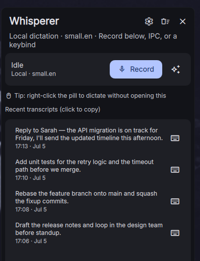

# Whisperer

Voice dictation for Linux: records your voice, transcribes it **locally** with whisper.cpp,
and types the result wherever your cursor is focused (plus copies it to the clipboard). Optional
cloud AI transcription cleans up and formats in one pass.

Built as a [DankMaterialShell](https://danklinux.com) (quickshell) bar-widget plugin for
niri/Wayland.

<p align="center">
  
  <br>
  <em>The popout: dictation controls plus your recent transcripts (click to copy, keyboard icon to re-type at the cursor).</em>
</p>

## How it works

```
right-click pill / popout Record button / IPC / your keybind
  → pw-record (PipeWire, 16kHz mono WAV → /tmp)
  → ffmpeg silence gate (skip empty clips)
  → whisper-cli (whisper.cpp, local ggml model)   ── or ──   audio-capable AI model (OpenRouter / Gemini)
  → wtype (types transcript at focused cursor)
  + dms cl copy (clipboard)
```

## Requirements

- **DankMaterialShell** ≥ 1.0.0 (the host shell)
- **PipeWire** — `pw-record` (capture), `pw-cli` (echo-cancel), `pw-play` (sound cues)
- **ffmpeg** — silence detection before transcription
- **wtype** — types the transcript into the focused window
- **whisper.cpp** — the `whisper-cli` binary (auto-detected on `PATH`; see [below](#whispercpp-binary)).
  Required for **local** transcription; AI dictation doesn't need it (see below).
- a **ggml model** — downloaded in-app from the settings model manager (local transcription only)

Optional:

- **secret-tool** (gnome-keyring) — stores AI API keys in the login keyring instead of the
  settings JSON. Only needed for AI transcription.
- **playerctl** — pauses media players while recording when PipeWire echo-cancellation isn't
  available (fallback for "remove background music").
- PipeWire **`libpipewire-module-echo-cancel`** — preferred path for removing speaker audio from
  the recording.

## Installation

### From the DMS plugin registry (recommended)

Install straight from within DMS — no manual file management, and updates are one click/command:

- **In-app**: DMS Settings → **Plugins** → **Browse**, find *Whisperer*, and install.
- **CLI**: `dms plugins install whisperer`

This clones the plugin into `~/.config/DankMaterialShell/plugins/` and wires it up automatically.
Update later with `dms plugins update whisperer`; remove with `dms plugins uninstall whisperer`.

### Manual (git clone)

Clone directly into the plugins directory — the repo root **is** the plugin (manifest at the top),
so no symlink or subfolder juggling:

```fish
git clone https://github.com/dwright134/dms-whisperer.git \
  ~/.config/DankMaterialShell/plugins/whisperer

systemctl --user reload dms.service   # or: dms restart
```

DMS watches the plugins folder, so it's usually picked up immediately; the reload guarantees it.
Update later with `git -C ~/.config/DankMaterialShell/plugins/whisperer pull`.

### After installing

1. **A local backend** — see [Local backends](#local-backends). whisper.cpp is the default and the
   plugin finds it on `PATH` automatically (the settings page shows a ✓ with the detected path, or a
   warning + re-detect button). To use faster-whisper instead, install it and pick it under
   **Settings → Transcription → Local backend** — only installed backends are offered.
2. **Choose a model** — both whisper.cpp and faster-whisper have a model manager in the settings
   (DMS Settings → Plugins → Whisperer) with download / cached / delete. `base.en` is a good default;
   Download one, then click it to make it active. `tiny.en` is fastest; `small`/`small.en` are more
   accurate; pick a multilingual model (`small`) if you dictate in a language other than English or
   want auto-detect.
3. **A keybind** (optional) — Whisperer doesn't claim any global shortcut. Dictation is started by
   **right-clicking the bar mic pill** (quick local toggle), from the **Record** / **AI** buttons
   in the popout (left-click the pill to open it), or via IPC (`dms ipc call whisperer toggle` /
   `toggleAi`). If you want a hotkey, bind those IPC calls to whatever keys are free — see
   [Keybindings](#keybindings).

Until the selected local backend is ready — each needs its command **and** a downloaded model — the
Record button is disabled and tells you what's missing, so nothing records a clip it can't transcribe. (AI mode only needs an API key; local
transcription is just its fallback.)

## Local backends

Local transcription runs through a **backend** you install yourself — the plugin bundles none of
them (no binaries, no vendored source). Whisperer auto-detects which are on your `PATH` and lets you
choose one in **Settings → Transcription → Local backend**; only installed backends appear in the
picker. None of this is needed for **AI dictation**, which runs on a cloud provider and only needs
an API key (local transcription is just its fallback) — if you only use AI mode, skip this section.

| Backend | Command | Model source | Best for |
|---------|---------|--------------|----------|
| **whisper.cpp** | `whisper-cli` | Whisperer's model manager (`.bin` files) | GPU builds (Vulkan/CUDA); the built-in downloader |
| **faster-whisper** | `whisper-ctranslate2` | Whisperer's model manager | Fastest on CPU (CTranslate2 int8) |

whisper.cpp is the default. Both backends have an in-settings model manager (download, cached
indicator, delete); whisper.cpp stores `ggml-*.bin` files, faster-whisper stores model directories
under `~/.local/share/whisperer/faster-whisper`. A model must be downloaded before you can select it —
neither backend fetches models implicitly.

### whisper.cpp

Whisperer finds the CLI on your `PATH` under the names `whisper-cli`, `whisper-cpp`, or
`whisper.cpp` (and falls back to a configured path if it's off `PATH`).

**From your package manager** (simplest — pick what your distro ships):

```fish
# Arch (AUR)
paru -S whisper.cpp          # or: yay -S whisper.cpp
# Nix
nix profile install nixpkgs#openai-whisper-cpp
# macOS / Linuxbrew
brew install whisper-cpp
```

Package binary names vary (`whisper-cli`, `whisper-cpp`); Whisperer checks all of them.

**Or build from upstream** (a local CPU build, tuned to your machine):

```fish
git clone https://github.com/ggml-org/whisper.cpp
cmake -S whisper.cpp -B whisper.cpp/build -G Ninja \
  -DCMAKE_BUILD_TYPE=Release -DBUILD_SHARED_LIBS=OFF
ninja -C whisper.cpp/build whisper-cli
cp whisper.cpp/build/bin/whisper-cli ~/.local/bin/   # ~/.local/bin is on PATH
```

(`GGML_NATIVE` is left on — since it's your own machine, `-march=native` is exactly what you want.)

**For a GPU build**, drop `-DBUILD_SHARED_LIBS=OFF` and add the backend flag — `-DGGML_VULKAN=ON`
(Vulkan) or `-DGGML_CUDA=ON` (CUDA) — plus that backend's dev packages (e.g. Vulkan headers +
`shaderc`/`spirv-headers`, or the CUDA toolkit). The resulting binary links backend `.so` files, so
keep them alongside it (or set an rpath). When Whisperer detects a GPU-capable `whisper-cli`, the
**Use GPU** toggle appears under the backend picker. Note that a weak/integrated GPU is often slower
than the CPU path, so it's off by default — benchmark before leaving it on.

### faster-whisper

The fastest option on CPU. Install the `whisper-ctranslate2` CLI (a drop-in, CTranslate2-backed
whisper command):

```fish
# Any distro (recommended) — isolated with pipx
pipx install whisper-ctranslate2

# Arch
sudo pacman -S python-pipx && pipx install whisper-ctranslate2
# Debian/Ubuntu
sudo apt install pipx && pipx install whisper-ctranslate2
# Fedora
sudo dnf install pipx && pipx install whisper-ctranslate2
```

Make sure `~/.local/bin` is on your `PATH` so the pipx command is found (`command -v
whisper-ctranslate2` should print a path). Download a model in **Settings → Transcription → Model**,
then select it. The plugin runs it with `--compute_type auto`, so CPU gets int8 and a CUDA-enabled
CTranslate2 uses the GPU automatically.

## Usage

- **Bar pill**: speaker bars (idle) → red pulsing stop icon + elapsed (recording) → waveform +
  "…" (transcribing). **Right-click** is a quick toggle for local dictation; **left-click** opens
  the popout (where the Record / AI buttons live). Left-click is deliberately *not* wired to
  recording — reflexively left-clicking a status pill to open its popout would start recordings by
  accident.
- **IPC** (the primary interface, bind it to any key you like): `dms ipc call whisperer
  toggle|toggleAi|start|startAi|stop|cancel|status`. `toggle` is local dictation, `toggleAi` is
  AI-cleanup dictation; running `toggleAi` mid-recording upgrades the current recording to AI mode.
- **Overlay** (bottom- or top-center): live waveform of real mic levels while
  recording (click it to stop, `Esc` to cancel), bouncing dots while transcribing, transcript
  preview flash when done.
- **Popout** (click the pill): **Record** / **AI** buttons to start dictation, last 20 transcripts
  (click to copy, keyboard icon to re-type at cursor), clear history, open settings.

## Keybindings

Whisperer claims no global shortcut of its own — you bind the IPC calls to whatever keys are free.
The `whisperer` IPC target exposes these functions:

| Function    | What it does                                                                 |
|-------------|------------------------------------------------------------------------------|
| `toggle`    | Start/stop **local** dictation (selected backend)                            |
| `toggleAi`  | Start/stop **AI** dictation; run mid-recording to upgrade the take to AI mode |
| `start`     | Start local dictation (no-op if already recording)                           |
| `startAi`   | Start AI dictation (no-op if already recording)                              |
| `stop`      | Stop recording and transcribe                                                |
| `cancel`    | Discard the current recording without transcribing                           |
| `status`    | Print the current state (`idle` / `recording` / `transcribing` / `error`)    |

Each is invoked as `dms ipc call whisperer <function>`, e.g. `dms ipc call whisperer toggle`.

### Binding from DMS Settings

In **DMS Settings → Keybinds**, add a bind and set its action type to **Run Command** (not *DMS
Action*), then enter:

```
dms ipc call whisperer toggle
```

> **Why not the "DMS Action" dropdown?** That dropdown is a fixed list of DMS's own built-in IPC
> actions, baked into the shell — it doesn't discover plugin IPC handlers, so Whisperer (and any
> other plugin) will never appear there. This is by design; **Run Command** is the supported path
> for plugin IPC, and it runs the exact same call under the hood.

### Binding directly in niri

Or add the binds to `~/.config/niri/dms/binds.kdl` — picking keys that aren't already taken:

```kdl
// example — choose any free combo
Mod+Shift+D { spawn "dms" "ipc" "call" "whisperer" "toggle"; }
Mod+Shift+A { spawn "dms" "ipc" "call" "whisperer" "toggleAi"; }
```

(This is a DMS-managed file — re-add the binds if DMS ever regenerates it.)

## Features

- **Pre-flight gate**: recording is blocked until a working local pipeline is present — the
  whisper.cpp binary and the selected model file. The Record button disables and shows the reason
  instead of recording a clip that can't be transcribed; it re-checks each time the popout opens,
  so installing the pieces ungates it without a restart.
- **AI transcription** (`toggleAi`): the audio itself is sent (base64, in-memory pipe) to an
  audio-capable model, which transcribes *and* formats in one pass — fillers/false starts removed,
  self-corrections applied, "new paragraph"-style commands honored — but the model is told never to
  add breaks on its own, so output stays on one line unless you ask. Custom vocabulary and snippet
  triggers are injected into the prompt so jargon is spelled right without whisper in the loop.
  Two providers, selectable in settings:
  - **OpenRouter** — model dropdown fetched live and filtered to audio-input models (default
    `google/gemini-3.5-flash`). Requests carry `X-Title: Whisperer` so a shared key shows per-app
    usage.
  - **Google (Gemini API)** — free-tier friendly; key from aistudio.google.com/apikey, model
    dropdown fetched from the account's catalog once a key is set (default `gemini-2.5-flash`).

  On any API failure it falls back to local whisper so the dictation isn't lost. Keys live in the
  login keyring (via `secret-tool`), never in the settings JSON, and are passed to curl via the
  environment, never argv.
- **Custom vocabulary**: add names, jargon, and tricky spellings in settings; they're passed to
  whisper as an initial prompt (`--prompt` + `--carry-initial-prompt`) to bias decoding. Keep the
  list to a few dozen entries — the prompt is capped at ~224 tokens and biasing weakens as it grows.
- **Languages & translation**: pick the dictation language in settings (English, auto-detect,
  Spanish, French, German — non-English needs a multilingual model), and optionally translate the
  output to English: locally via whisper's translate task (`-tr`), and in AI mode the model is
  instructed to translate instead of preserving the spoken language.
- **Backend tuning**: under the local-backend picker, a **CPU threads** slider (drives
  whisper.cpp `-t` and faster-whisper `--threads`, with its maximum capped to the machine's
  thread count) and, for whisper.cpp, a **Use GPU (Vulkan/CUDA)** toggle. The toggle only
  appears when the detected `whisper-cli` was actually built with a GPU backend, and is off by
  default (it adds `--no-gpu`) — integrated GPUs are frequently slower than the CPU, so benchmark
  before enabling.
- **Voice snippets**: define trigger phrase → full text pairs. The expansion is typed when the
  *entire* dictation matches a trigger (ignoring case/punctuation, in both local and AI mode) —
  triggers inside longer sentences are left alone. `\n` in the expansion becomes a real line break.
- **Newline-safe typing**: line breaks (AI formatting, snippet expansions) are sent as Shift+Enter
  key events, not literal Returns, so they insert a break in chat-style inputs instead of
  submitting mid-dictation.
- **Silence gate**: if the recording's peak level is below -40 dB, transcription is skipped
  entirely (no whisper hallucinations typed into the focused window). Non-speech tokens are also
  suppressed (`--suppress-nst`) and bracketed annotations scrubbed; output with no real words is
  dropped.
- **Remove background music**: strip speaker audio from the recording using PipeWire echo
  cancellation when available, falling back to pausing media players (playerctl) while recording.
- **Auto-stop on silence** (off by default): stop on its own after a configurable 1–15 s of
  silence. It only arms once you've said something, and voice detection is relative to an adaptive
  noise floor, so mic volume and room noise don't need tuning. Either way there's a 5-minute cap.
- **Sound cues**: freedesktop chimes on start / done / error (toggleable).

## Repo layout

The repo is *only* the plugin — no bundled binary or vendored source:

```
dms-whisperer/            ← the plugin (this repo root)
  plugin.json             ← manifest
  Whisperer.qml           ← bar widget, state machine, overlay window, popout
  WhispererSettings.qml   ← settings UI + model manager
  Sounds/                 ← start/done/error cues
```

External runtime pieces, installed on the host (not part of this repo):

- `whisper-cli` on `PATH` (e.g. `~/.local/bin/whisper-cli`) — see [whisper.cpp binary](#whispercpp-binary)
- `~/.local/share/whisperer/models/` — ggml models (`base.en` default), downloaded in-app
- `~/.config/niri/dms/binds.kdl` — any optional keybinds you add for `toggle` / `toggleAi`

(If you build whisper.cpp locally, keep that checkout *outside* the plugin directory so it never
ends up in the plugin you distribute.)

## Debugging

```fish
qs list --all                      # find the shell instance
qs log -i <instance-id> | grep -i whisperer
dms ipc call whisperer status
```

## License

[MIT](LICENSE) © Daniel Wright
